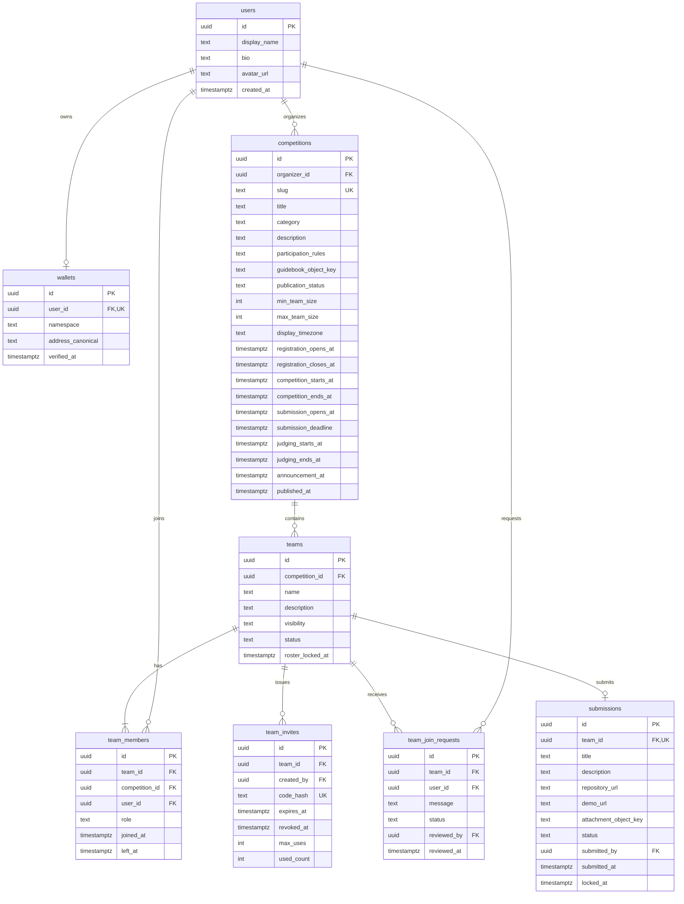
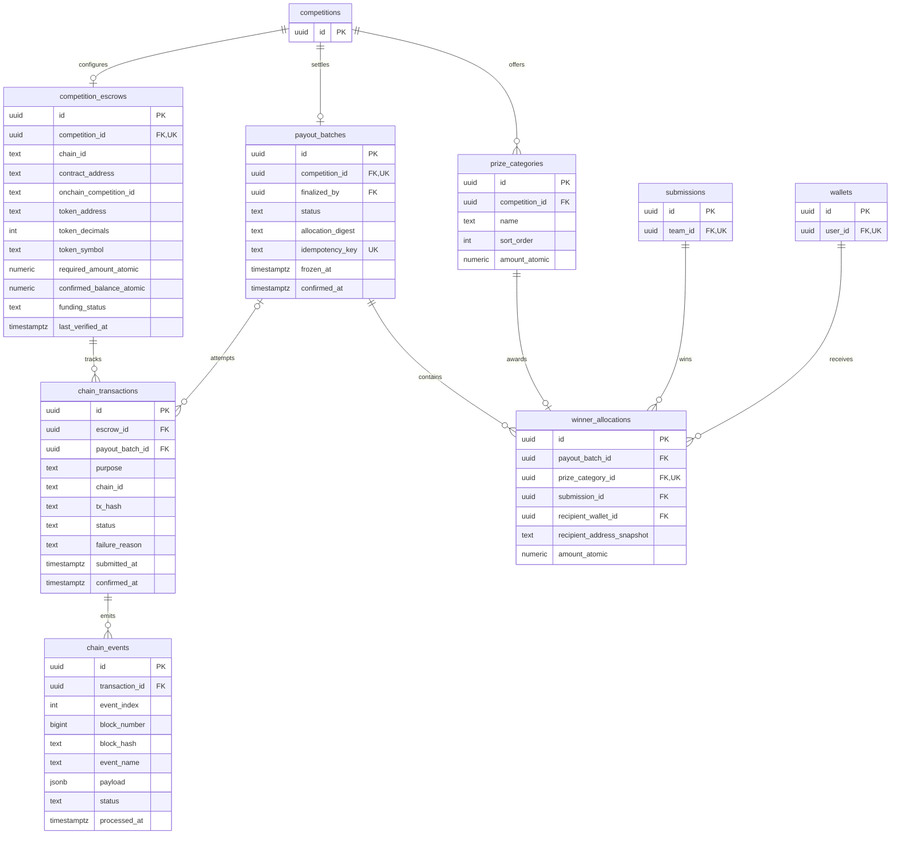

# Cobalt Protocol — ERD MVP v0.1

Draft diskusi backend • 18 September 2026

## Keputusan produk

- Login wallet-only.
- Kompetisi wajib fully funded sebelum publish.
- Organizer memilih pemenang secara langsung.
- Join melalui invite code atau request untuk public team.
- Hadiah otomatis ditransfer ke wallet leader setelah finalisasi. Tidak ada claims.
- Backend menangani domain aplikasi; layanan Web3 menangani kontrak dan verifikasi blockchain. Database menyimpan hasil verifikasi, bukan mempercayai laporan sukses frontend.

## Asumsi desain yang masih perlu disepakati

- PostgreSQL sebagai acuan tipe data; ERD ini belum merupakan migration SQL.
- Satu wallet terverifikasi per akun pada MVP, satu network/token per kompetisi.
- Tim khusus untuk satu kompetisi. User dapat berada di banyak kompetisi, tetapi hanya satu tim aktif per kompetisi.
- Membuat/join tim sekaligus menjadi registrasi kompetisi. Tidak ada approval registrasi terpisah.
- Satu submission per tim, dapat diedit sampai deadline; hasil dan waktu finalisasi disimpan terpisah.
- Satu penerima tim per kategori hadiah. Apakah satu tim boleh menang beberapa kategori masih merupakan aturan produk.
- Leader menjadi satu-satunya pelaku submit final; transfer leadership dan perubahan roster dikunci pada deadline yang disepakati.
- Satu settlement batch per kompetisi, dengan transaksi batch atomic sebagai usulan untuk MVP. Retry menjadi transaction attempt baru untuk batch yang sama.
- Sertifikat belum dimodelkan: UI menampilkannya, tetapi format, penerima, dan proses penerbitan belum diputuskan. Ini bukan keputusan menghapus fitur.

## ERD 1 — Identitas, kompetisi, dan tim

Wallet 0..1 mencerminkan tahap provisioning akun; akun yang dapat login wajib mempunyai wallet terverifikasi. Namespace + canonical address harus unik. Jangan mengasumsikan semua chain memakai normalisasi address yang sama.

Leader ditentukan oleh membership aktif dengan role LEADER; tidak ada teams.leader_id kedua yang berpotensi berbeda. Setiap tim wajib mempunyai tepat satu leader aktif, termasuk saat transfer leadership.

## ERD 2 — Hadiah, pendanaan, dan pembayaran

Transaction purposes: FUNDING, PAYOUT, REFUND. REFUND hanya menyediakan tempat pencatatan; kebijakan pembatalan/refund masih perlu kesepakatan. tx_hash wajib setelah broadcast dan unik bersama chain_id. Satu transaksi PAYOUT wajib mengarah ke batch; FUNDING/REFUND tidak wajib mempunyai batch.

winner_allocations menghubungkan hadiah ke submission, sehingga tim diperoleh melalui submission.team_id. Penerima disimpan sebagai wallet FK untuk pelacakan akun, ditambah address snapshot yang immutable saat batch dibekukan. Network/token berasal dari escrow kompetisi dan ikut dikunci. Jangan gunakan wallet/leader terkini untuk mengubah tujuan pembayaran setelah freeze.

Tidak ada payout_items tambahan: setiap winner_allocation sudah merupakan item batch. Untuk batch atomic, status pembayaran berada di payout_batches; jika kelak pembayaran per penerima diperbolehkan, tambahkan status dan transaction mapping per allocation.

## Tabel pendukung

| Tabel | Kolom utama | Fungsi |
|---|---|---|
| auth_challenges | id, namespace, address_canonical, nonce_hash UNIQUE, message_digest, expires_at, consumed_at | Verifikasi signature sekali pakai; terikat domain/network sesuai protokol wallet yang dipilih |
| auth_sessions | id, user_id FK, token_hash UNIQUE, expires_at, revoked_at | Session login dan logout |
| audit_logs | id, actor_user_id FK nullable, competition_id FK nullable, action, entity_type, entity_id, metadata JSONB, created_at | Jejak perubahan hadiah, leader, anggota, submission, dan finalisasi; actor null untuk sistem |

Semua tabel mutable memiliki created_at dan updated_at, tidak diulang dalam diagram agar ringkas. FK reviewer/submitted_by/finalized_by/created_by mengarah ke users. Field waktu tindakan dan reviewer nullable sebelum tindakan terjadi. Gunakan RESTRICT untuk penghapusan data finansial; jangan cascade-delete riwayat pembayaran.

## Constraint dan transaksi database

1. UNIQUE(wallets.namespace, wallets.address_canonical), UNIQUE(wallets.user_id).
2. UNIQUE(teams.id, teams.competition_id) dan FK komposit team_members(team_id, competition_id) ke teams(id, competition_id). competition_id pada membership sengaja disimpan agar aturan satu tim per kompetisi dapat ditegakkan.
3. Partial UNIQUE(team_members.competition_id, user_id) WHERE left_at IS NULL; partial UNIQUE(team_id) WHERE role = 'LEADER' AND left_at IS NULL. Constraint kedua menjamin paling banyak satu leader; service/deferred trigger menjamin setidaknya satu pada commit.
4. Partial UNIQUE(team_join_requests.team_id, user_id) WHERE status = 'PENDING'. Setelah user diterima, batalkan request pending lain di kompetisi yang sama.
5. Join via code dan acceptance request memakai transaksi DB yang mengunci team row, memeriksa deadline/kapasitas/membership, lalu menambah anggota. Konsumsi kuota invite dilakukan dalam transaksi yang sama.
6. UNIQUE(submissions.team_id). Submission minimal DRAFT/SUBMITTED; hasil menang disimpan melalui allocation, bukan menimpa status submission. Edit hanya sebelum deadline; locked_at menandai versi yang dibekukan.
7. UNIQUE(prize_categories.competition_id, name), amount_atomic > 0. Amount menggunakan integer decimal arbitrary precision, misalnya NUMERIC(78,0) dengan batas chain yang disepakati; JSON API mengirimnya sebagai string, bukan JS Number.
8. UNIQUE(winner_allocations.prize_category_id), UNIQUE(payout_batches.competition_id). Guard transaksi/trigger memastikan category, submission, dan batch milik kompetisi yang sama, submission eligible, serta recipient merupakan wallet leader tim pada waktu freeze.
9. UNIQUE(chain_transactions.chain_id, tx_hash), UNIQUE(chain_events.transaction_id, event_index). Event ingestion dan perubahan domain dilakukan secara idempotent dalam transaksi DB.
10. Batch freeze mengunci hadiah, submission pemenang, recipient snapshot dan amount. Retry memakai allocation yang sama. Chain contract juga wajib menolak settlement ganda; constraint DB saja tidak cukup.
11. Publish hanya setelah pendanaan terverifikasi mencukupi total hadiah dengan network/token/escrow yang sesuai. required_amount_atomic merupakan snapshot jumlah hadiah, confirmed_balance_atomic merupakan cache yang diperbarui dari chain. Perubahan hadiah sebelum publish harus menghitung ulang kebutuhan dana; sesudah publish hadiah dikunci.
12. Validasi urutan waktu per window (open < close), submission deadline <= judging start, judging end <= announcement. Registration dan submission boleh overlap; jangan mewajibkan registrasi tutup sebelum submission dibuka.

## Status yang dipisahkan

| Domain | Status usulan |
|---|---|
| Publication | DRAFT, PUBLISHED, CANCELLED, COMPLETED |
| Funding | UNFUNDED, PENDING, INSUFFICIENT, FUNDED, REFUNDED |
| Team | ACTIVE, DISQUALIFIED, WITHDRAWN |
| Visibility | PUBLIC, PRIVATE |
| Join request | PENDING, ACCEPTED, REJECTED, CANCELLED, EXPIRED |
| Submission | DRAFT, SUBMITTED |
| Payout batch | DRAFT, FROZEN, SUBMITTED, CONFIRMED, FAILED |
| Chain transaction | SUBMITTED, CONFIRMED, REVERTED, REPLACED |
| Chain event | OBSERVED, CONFIRMED, ORPHANED |

Phase tampilan seperti registration open, submission open, judging diturunkan dari timeline. Jangan mencampur semua phase, funding, dan payout ke satu enum: registrasi dan submission bisa berlangsung bersamaan.

PENDING funding tidak berarti saldo escrow telah bertambah. Timeout RPC atau tx yang belum ditemukan bukan bukti transaksi gagal. Reconcile receipt/event dan transaksi pengganti sebelum membuat retry; chain reorganization harus memicu rekonsiliasi berdasarkan block hash dan kebijakan finality network.

## Finalisasi dan batas tanggung jawab

1. Organizer menyimpan draft allocations. Backend memvalidasi prize, submission, leader, serta jumlah.
2. Organizer mengonfirmasi daftar. Backend membekukan batch dan snapshot penerima dalam satu transaksi DB.
3. Usulan MVP: wallet organizer menandatangani transaksi settlement, contract mentransfer hadiah ke leader. Mekanisme signer ini masih perlu persetujuan tim Web3.
4. Backend menyimpan tx attempt. Event yang sudah diverifikasi dengan finality yang disepakati mengubah batch menjadi CONFIRMED.
5. Hanya setelah seluruh pembayaran batch terkonfirmasi, kompetisi dapat ditandai COMPLETED. Tidak ada langkah claim atau tenggat claim.
6. Signature dibatalkan sebelum broadcast: belum ada payout; batch bisa menunggu signature ulang. Tx pending: monitor/reconcile, jangan langsung menyebut gagal. Tx reverted: retry setelah sebab ditangani.

Backend bertanggung jawab atas login, permission, tim, jadwal, submission, draft winner, read model, serta audit. Contract bertanggung jawab atas otorisasi settlement, aset escrow, transfer, dan pencegahan double payout. Indexer memverifikasi dan mengirim event untuk rekonsiliasi.

## Keputusan terbuka sebelum migration final

- Network/token dan bentuk escrow (contract per kompetisi atau shared contract dengan onchain_competition_id).
- Mekanisme signature finalisasi dan batas jumlah hadiah dalam atomic batch.
- Batas perubahan leader/roster dan penanganan wallet bermasalah sebelum freeze.
- Apakah satu tim boleh memenangkan beberapa kategori; apa yang terjadi jika kategori tidak mempunyai pemenang.
- Pembatalan setelah funded, kompetisi tanpa submission, organizer tidak finalisasi, dan pengembalian sisa dana.
- Sertifikat: off-chain/on-chain, per anggota atau per tim, serta apakah wajib pada MVP.

ERD ini siap menjadi baseline review, tetapi keputusan terbuka di atas tidak dianggap sudah disetujui.
